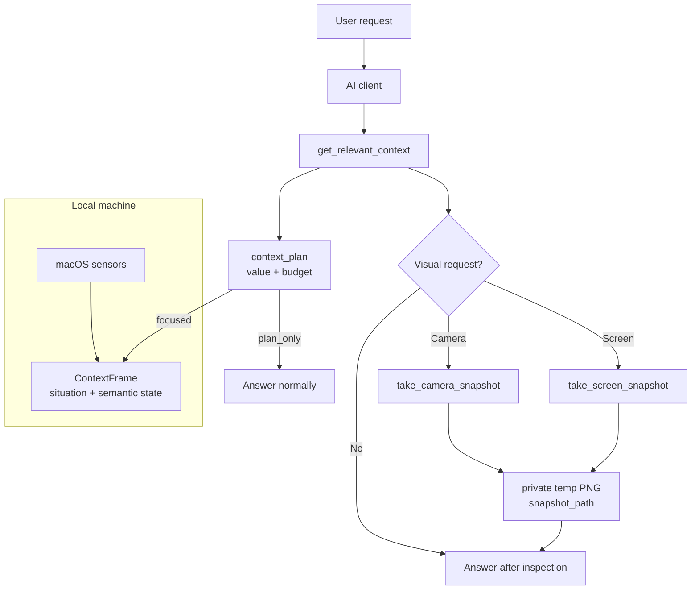

<div align="center">

# sense-mcp

### Local situational awareness for AI agents.

MCP gave AI tools and memory. Sense gives it privacy-first local context.

[](https://github.com/ChrisJDiMarco/sense-mcp/actions/workflows/ci.yml)
[](./LICENSE)
[](https://nodejs.org/)
[](https://modelcontextprotocol.io/)
[](#requirements)

</div>

`sense-mcp` is a local MCP server that acts as a context broker for AI clients.
It helps the client decide whether local context would actually improve the
answer, then exposes the smallest useful signal: active work mode, presence,
time pressure, battery, device setup, rough environment, a compact situation
card, and optional explicit camera/screen snapshots. The server is
client-agnostic MCP; the built-in sensors are macOS-first today.

It is built around one constraint: **the AI should understand the moment without
surveilling the person.**

```text
You: "help me knock this out fast"

AI calls get_relevant_context:
  coding, active, plugged in, next meeting in 18 minutes

AI:
  "You have about 15 usable minutes. Do the smallest safe step:
   run tests, fix only the failing path, and leave a handoff note."
```

## What Makes Sense Different

| Principle | Meaning |
|---|---|
| Local only | Sensors run on the user's machine. |
| Pull based | Nothing is injected into prompts. The AI asks when context helps. |
| Ephemeral | Context frames describe now and expire quickly. |
| Semantic by default | Sense emits `"coding"`, `"quiet"`, and `"high"` time pressure, not raw private content. |
| Explicit media | Camera and screen snapshots are opt-in tools, never background sensors. |

Read the full privacy contract in [docs/PRIVACY.md](./docs/PRIVACY.md).

## Reliability Pass

Sense now includes a small trust layer around the raw sensors:

| Layer | What it improves |
|---|---|
| Smarter router | Returns intent, confidence, minimum tool, avoided tools, fallbacks, and privacy notes. |
| Context broker | Adds `context_plan` with expected value, token budget, included/excluded context, and connector hints. |
| Situation card | Adds a compact summary, evidence, unknowns, risks, recommendations, and recent safe changes. |
| Context quality | Marks fields as observed, classified, derived, or summary, with source and staleness. |
| State smoothing | Adds a short in-memory stability signal so app switches do not get overread. |
| Sensitivity labels | Flags private communication, banking, credentials, and health contexts generically. |
| Capability diagnostics | Explains missing Calendar, mic, focus, and ambient-light signals instead of just saying unavailable. |
| Privacy ledger | Records local metadata about Sense tool calls, reasons, budgets, and artifacts without storing frames or pixels. |
| Doctor command | Checks Node, platform, ffmpeg, config, opt-ins, workspace, panel, and live sensor diagnostics. |
| Routing eval | Runs adversarial fixtures and the 51-prompt routing pack in `npm run check`. |

## Architecture

```text
User asks
  |
  v
AI calls get_relevant_context
  |
  +--> no expected value: answer normally, no frame
  |
  +--> useful local context: use tiny situation card + focused ContextFrame
  |
  +--> visual request: call one explicit snapshot tool
          |
          v
      inspect private snapshot_path, then answer
```



## Status

`v0.1.0` public preview.

macOS is the primary supported platform today. Sensors that are unavailable on a
machine disable themselves, so the ContextFrame degrades gracefully.

See [CHANGELOG.md](./CHANGELOG.md), [ROADMAP.md](./ROADMAP.md), and
[docs/KNOWN_LIMITATIONS.md](./docs/KNOWN_LIMITATIONS.md) for release state,
planned work, and current boundaries.

## Quickstart

```bash
git clone https://github.com/ChrisJDiMarco/sense-mcp.git
cd sense-mcp
npm install
npm run build
npm run check
```

Then generate an MCP client config:

```bash
node dist/index.js init --client codex --profile visual --workspace /absolute/path/to/workspace
```

Or write the Codex config directly:

```bash
node dist/index.js init --write --profile visual --workspace /absolute/path/to/workspace
```

Restart your MCP client, then verify setup:

```bash
node dist/index.js doctor
```

## Setup Profiles

| Profile | Enables | Best for |
|---|---|---|
| `safe` | Semantic context only | Trying Sense with no explicit media |
| `developer` | Screen snapshots | Coding and UI/debug help |
| `visual` | Camera and screen snapshots | Appearance, desk, room, and screen questions |
| `full` | Camera, screen, and mic level | Full local context with explicit opt-ins |

Raw window titles are never enabled by a profile. Use `--raw-titles` only when
you intentionally want redacted title exposure.

## Requirements

| Requirement | Why |
|---|---|
| Node.js 18+ | Runs the MCP server |
| macOS | Current OS sensors use macOS APIs |
| `ffmpeg` | Camera availability, camera snapshots, mic level sampling |
| macOS permissions | Camera, Screen Recording, Microphone, Accessibility/Automation as needed |

Install `ffmpeg` on macOS:

```bash
brew install ffmpeg
```

## Configure Claude Desktop

Add Sense to `claude_desktop_config.json`:

```json
{
  "mcpServers": {
    "sense": {
      "command": "node",
      "args": ["/absolute/path/to/sense-mcp/dist/index.js"]
    }
  }
}
```

See [examples/claude_desktop_config.json](./examples/claude_desktop_config.json).
For the complete guide, see [docs/clients/claude-desktop.md](./docs/clients/claude-desktop.md).

## Configure Codex

Add Sense to `~/.codex/config.toml`:

```toml
[mcp_servers.sense]
command = "node"
args = ["/absolute/path/to/sense-mcp/dist/index.js"]
startup_timeout_sec = 20
```

Optional opt-ins:

```toml
[mcp_servers.sense.env]
SENSE_CAMERA_SNAPSHOT = "1"
SENSE_SCREEN_SNAPSHOT = "1"
SENSE_WORKSPACE_ROOTS = "/absolute/path/to/workspace"
```

See [examples/codex_config.toml](./examples/codex_config.toml).
For the complete guide, see [docs/clients/codex.md](./docs/clients/codex.md).

Restart your MCP client after changing config.

## Control Panel

Sense includes a localhost-only control panel:

```bash
node dist/index.js panel --open
```

After global or npm installation:

```bash
sense-mcp panel --open
```

The panel shows capability state, the trust model, health checks, the privacy
ledger, recent explicit snapshot metadata, recent explicit tool activity, and
known Sense env toggles. It binds to `127.0.0.1`, rejects non-local Host
headers, and requires an ephemeral token for permission changes.

## Tools

| Tool | Purpose | Captures media? |
|---|---|---:|
| `get_context_frame` | Full ContextFrame plus privacy and assistive posture | No |
| `get_relevant_context` | Classifies the request and returns a context plan with value, budget, and the narrowest Sense tools | No |
| `get_screen_context` | Current activity and privacy-safe work context | No |
| `get_user_state` | Presence, idle state, and input cadence | No |
| `get_environment_context` | Time, power, devices, media, light/noise/location when available | No |
| `get_schedule_context` | Meeting state and time pressure | No |
| `get_domains` | Selected ContextFrame domains | No |
| `take_camera_snapshot` | One explicit webcam snapshot for a current visual request | Yes, opt-in |
| `take_screen_snapshot` | One explicit screenshot for a current visual/debug request | Yes, opt-in |

Every ContextFrame includes a `privacy` block with per-capability status:
`granted`, `denied`, or `unavailable`.

## Sensor Matrix

| Sensor | Signal | Source |
|---|---|---|
| `active-window` | Frontmost app, activity class, privacy-safe window label | macOS `osascript` |
| `idle` | Seconds since last input, presence, input cadence | macOS `ioreg` |
| `time-context` | Day segment, daylight class, workday, local time | local clock |
| `battery` | Battery percent, power source, low-power flag | macOS `pmset` |
| `devices` | External display count, broad Bluetooth classes | macOS `system_profiler` |
| `workspace` | Configured workspace name, git branch, dirty count | local `git` |
| `calendar` | Meeting state, next-event minutes, pressure class | macOS Calendar via `osascript` |
| `location` | Coarse location class from configured Wi-Fi names | macOS `networksetup` |
| `media` | Media app and playing/paused state | Spotify/Music via `osascript` |
| `ambient-light` | Lighting class when an ALS sensor exists | macOS `ioreg` |
| `audio-level` | Opt-in noise class and dB level, never audio content | `ffmpeg` AVFoundation |
| `focus-mode` | Env/Shortcuts bridge for Focus/DND mode | env or macOS Shortcuts |
| `camera` | Camera availability and device count only | `ffmpeg` AVFoundation |
| `health-bridge` | Optional local health/wearable semantic JSON | local JSON file |
| `weather-bridge` | Optional local weather/daylight semantic JSON | local JSON file |

Calendar note: when an AI client has a direct Google Calendar or calendar
connector, use that connector for account schedule data. Sense's Calendar sensor
is a local fallback and reports diagnostics when macOS Calendar automation is
slow or unavailable.

## Opt-Ins

| Env var | Effect |
|---|---|
| `SENSE_CAMERA_SNAPSHOT=1` | Enables explicit `take_camera_snapshot` |
| `SENSE_SCREEN_SNAPSHOT=1` | Enables explicit `take_screen_snapshot` |
| `SENSE_SNAPSHOT_DIR=/path` | Private temp directory for explicit snapshots |
| `SENSE_MIC_LEVEL=1` | Enables one-second mic level sampling for `noise_class` |
| `SENSE_MIC_DEVICE_INDEX=2` | Selects the AVFoundation audio device index |
| `SENSE_WORKSPACE_ROOTS=/path/to/repo` | Enables git branch/dirty-count context |
| `SENSE_HOME_WIFI_SSIDS=ssid1,ssid2` | Classifies home Wi-Fi without emitting SSIDs |
| `SENSE_OFFICE_WIFI_SSIDS=ssid1,ssid2` | Classifies office Wi-Fi without emitting SSIDs |
| `SENSE_FOCUS_MODE=deep_work` | Manual Focus/DND semantic override |
| `SENSE_FOCUS_SHORTCUT="Sense Current Focus"` | Optional Shortcuts bridge for current Focus mode |
| `SENSE_HEALTH_CONTEXT_PATH=/path/health.json` | Reads whitelisted wearable fields |
| `SENSE_WEATHER_CONTEXT_PATH=/path/weather.json` | Reads whitelisted weather fields |

## Explicit Snapshot Rules

`take_camera_snapshot` and `take_screen_snapshot` are intentionally separate
from `get_context_frame`.

They follow five rules:

1. Disabled unless the user opts in.
2. Require a current reason argument.
3. Used only for visual requests in the active conversation.
4. Return MCP image content and a private temporary `snapshot_path`.
5. Never used for ordinary writing, coding, planning, or background context.

Old snapshot files in the temp directory are cleaned up on later snapshot calls.

## CLI

```bash
node dist/index.js init --help
node dist/index.js init --write --profile visual --workspace /absolute/path/to/workspace
node dist/index.js status
node dist/index.js doctor
node dist/index.js ledger
node dist/index.js panel --open
node dist/index.js enable camera
node dist/index.js enable screen
node dist/index.js enable mic
node dist/index.js enable workspace /absolute/path/to/workspace
node dist/index.js disable mic
```

The CLI can generate client config, write the Codex `sense` server block, and
edit the `sense` env block in `~/.codex/config.toml`.

`doctor` gives actionable setup checks:

```text
PASS Node.js: v22.0.0
PASS ffmpeg: available
WARN Camera snapshot: disabled
  Fix: Run sense-mcp enable camera or use the Sense panel.
WARN Focus mode sensor: No SENSE_FOCUS_MODE env value and Shortcut "Sense Current Focus" did not return a mode.
  Fix: Set SENSE_FOCUS_MODE=deep_work or create a macOS Shortcut named Sense Current Focus that returns text.
```

## ContextFrame Spec

Sense emits the open `context-frame/0.2` envelope:

```json
{
  "spec": "context-frame/0.2",
  "generated_at": "2026-06-15T12:00:00-04:00",
  "privacy": {
    "tier": 1,
    "capabilities": {
      "screen_activity": "granted",
      "camera_snapshot": "denied"
    },
    "capability_details": {
      "focus_mode": {
        "sensor": "focus-mode",
        "reason": "missing_focus_bridge",
        "detail": "No focus-mode bridge is configured."
      }
    }
  },
  "situation": {
    "summary": "User appears active working in sense-mcp, activity looks like coding, with 3 changed items, plugged in.",
    "confidence": "medium",
    "evidence": ["workspace sense-mcp", "activity coding", "3 changed items", "power ac_power"],
    "unknowns": ["calendar: calendar_query_timeout"],
    "recommendations": ["Use a direct calendar connector for account schedule timing when needed."],
    "recent_changes": ["Working in sense-mcp (coding)", "Power ac_power"]
  },
  "screen": {
    "activity_class": "coding",
    "active_window_label": "code editor"
  },
  "user": {
    "presence": "active",
    "input_cadence": "steady"
  },
  "schedule": {
    "time_pressure": "moderate"
  },
  "assistive_posture": "do_not_interrupt",
  "quality": {
    "overall_freshness": "fresh",
    "fields": {
      "screen": {
        "activity_class": {
          "source": "active-window",
          "classification": "classified",
          "staleness_ms": 1200
        }
      }
    },
    "stability": {
      "screen_activity": "stable"
    }
  }
}
```

See [SPEC.md](./SPEC.md) for the full schema.

## Docs

| Doc | Use it for |
|---|---|
| [docs/clients/codex.md](./docs/clients/codex.md) | Codex setup and guidance |
| [docs/clients/claude-desktop.md](./docs/clients/claude-desktop.md) | Claude Desktop setup |
| [docs/clients/claude-code.md](./docs/clients/claude-code.md) | Claude Code setup notes |
| [docs/clients/cursor.md](./docs/clients/cursor.md) | Cursor setup notes |
| [docs/PROMPTING.md](./docs/PROMPTING.md) | Client prompting rules |
| [docs/EXAMPLES.md](./docs/EXAMPLES.md) | Example router outputs |
| [docs/evals/SENSE_BENCH.md](./docs/evals/SENSE_BENCH.md) | Automated and manual eval loop |
| [docs/RELEASE.md](./docs/RELEASE.md) | Release and npm checklist |

## Writing a Sensor

A sensor is one small module implementing one interface:

```ts
import type { Sensor, Observation } from "../types.js";

export const mySensor: Sensor = {
  name: "battery",
  intervalMs: 30_000,
  async sample(): Promise<Observation[]> {
    return [{
      sensor: "battery",
      domain: "environment",
      fields: { on_battery: true },
      observedAt: Date.now(),
      ttlMs: 60_000,
    }];
  },
};
```

Register it in `src/sensors/index.ts`.

Sensor rules:

1. Emit semantic states, never raw private content.
2. Do not make network calls from sensors.
3. Do not write raw sensor data to persistent storage.
4. Fail gracefully and return `[]` on errors.

See [CONTRIBUTING.md](./CONTRIBUTING.md).

## Evals

[docs/evals/sense-mcp-eval-prompts.md](./docs/evals/sense-mcp-eval-prompts.md)
contains prompts for comparing Sense-enabled and baseline agent behavior.

The eval pack checks:

- relevance routing
- context value and token-budget policy
- camera and screen tool selection
- time-pressure fit
- workspace awareness
- privacy boundaries
- permission failure handling

Run the automated checks:

```bash
npm run build
npm run eval:routing
npm run eval:prompt-pack
```

Current recorded router score:

- adversarial routing fixtures: `15/15`
- prompt-pack routing expectations: `51/51`

See [docs/evals/results/2026-06-15-router-benchmark.md](./docs/evals/results/2026-06-15-router-benchmark.md).

## Security

Please report vulnerabilities privately. See [SECURITY.md](./SECURITY.md).

## License

MIT
