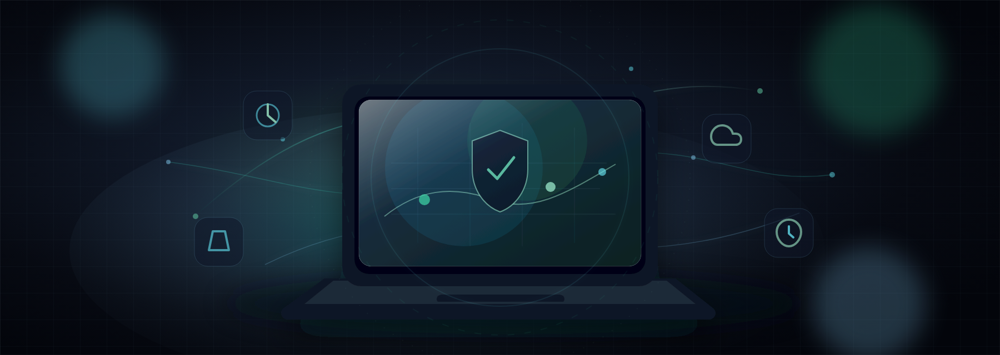
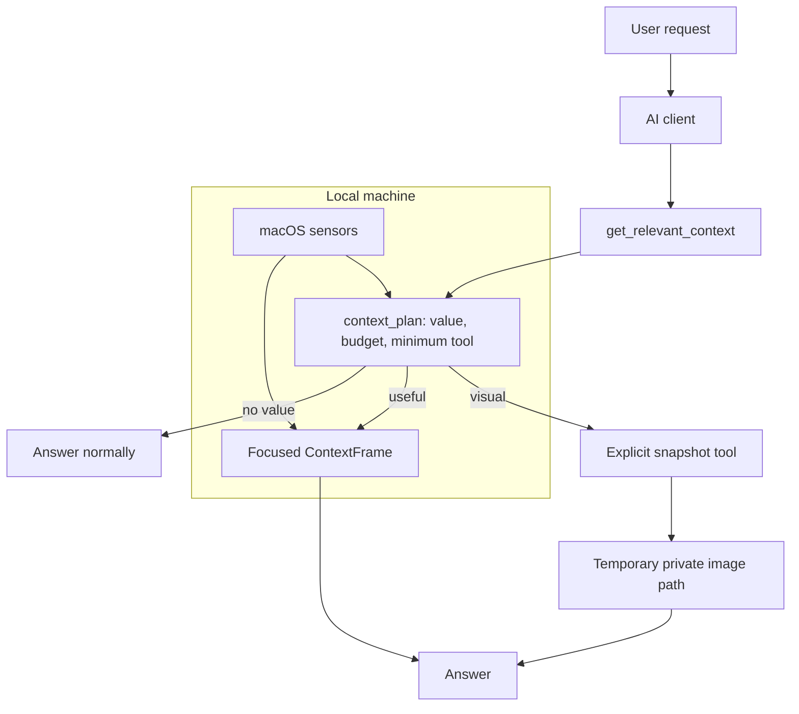

<div align="center">



# sense-mcp

### Privacy-first local situational awareness for AI agents.

MCP gave agents tools. Memory gives them history. Sense gives them the current moment.

[](https://github.com/ChrisJDiMarco/sense-mcp/actions/workflows/ci.yml)
[](./LICENSE)
[](https://nodejs.org/)
[](https://modelcontextprotocol.io/)
[](#requirements)
[](#privacy-contract)

</div>

`sense-mcp` is a local MCP server that lets an AI client ask for the smallest
useful slice of local context: what you are working on, whether you seem active,
whether time pressure is high, what devices are connected, whether optional
workspace state is relevant, and when explicitly requested, one camera or screen
snapshot.

It is a context broker, not a surveillance layer. The agent does not receive a
constant feed. It asks Sense only when context would likely improve the answer,
and Sense answers with semantic, short-lived signals by default.

```text
You: "help me knock this out fast"

AI calls get_relevant_context:
  active in editor, coding, plugged in, next meeting soon, workspace dirty

AI:
  "You have a short window. Do the smallest useful step:
   run the failing test, fix only that path, and leave a handoff note."
```

## Why Sense Exists

Most AI assistants are oddly blind to the moment they are helping in. They can
read a repo, browse docs, and call APIs, but they do not know if you are in a
meeting crunch, actively coding, on battery, looking at an error screen, or
asking a visual question that needs a fresh snapshot.

Sense fills that gap with three rules:

| Rule | What it means |
|---|---|
| Ask first | Nothing is injected into every prompt. The client pulls context when it helps. |
| Say less | Emit semantic states like `coding`, `active`, `moderate` time pressure, and `quiet`. |
| Keep it local | Sensors run on the user's machine. Explicit media snapshots stay temporary. |

## What Sense Can Help With

| User asks | Sense gives the agent |
|---|---|
| "What am I doing right now?" | A compact situation card with activity, presence, device, workspace, and schedule signals. |
| "Can you help me debug this screen?" | A recommendation to take one explicit screen snapshot, then inspect the returned image path. |
| "How do I look?" | A recommendation to take one explicit camera snapshot if camera snapshots are enabled. |
| "Do I have time for this?" | Time pressure, meeting proximity, active work mode, and confidence/unknowns. |
| "Pick up where we left off." | Current workspace name, branch, dirty count, and recent safe changes when workspace context is enabled. |
| "Should you use context here?" | A router decision with expected value, token budget, avoided tools, and privacy notes. |

## How It Works



Sense exposes both raw MCP tools and a higher-level router:

1. `get_relevant_context` decides whether context helps.
2. If useful, it returns a context plan, a compact situation card, and the
   narrowest recommended follow-up tools.
3. If a visual answer is requested, the client can call exactly one explicit
   snapshot tool and inspect the returned `snapshot_path`.

## Privacy Contract

Sense is built around one constraint:

> The AI should understand the moment without surveilling the person.

| Principle | Implementation |
|---|---|
| Local only | Sensors run locally. No background network calls from sensors. |
| Pull based | Context is requested by the AI client only when useful. |
| Ephemeral | Context frames describe now and expire quickly. |
| Semantic by default | The server emits classified states, not raw private content. |
| Explicit media | Camera and screen snapshots are opt-in tools, never background streams. |
| Temporary artifacts | Snapshot files are stored in a private temp directory and cleaned up later. |
| Auditability | A local privacy ledger records tool-call metadata without storing frames or pixels. |

Read the full privacy model in [docs/PRIVACY.md](./docs/PRIVACY.md).

## Current Status

`v0.1.0` public preview.

Sense is client-agnostic MCP. The built-in sensors are macOS-first today, and
unavailable sensors degrade gracefully with diagnostics instead of hard failure.

Current reliability checks:

| Check | Current result |
|---|---:|
| Unit tests | 83 passing |
| Adversarial routing fixtures | 15/15 |
| Prompt-pack routing expectations | 51/51 |
| Production dependency audit | 0 vulnerabilities |
| CI matrix | Node 20 and Node 22 |

See [CHANGELOG.md](./CHANGELOG.md), [ROADMAP.md](./ROADMAP.md), and
[docs/KNOWN_LIMITATIONS.md](./docs/KNOWN_LIMITATIONS.md).

## Quickstart

```bash
git clone https://github.com/ChrisJDiMarco/sense-mcp.git
cd sense-mcp
npm install
npm run build
npm run check
```

Generate an MCP client config:

```bash
node dist/index.js init --client codex --profile visual --workspace /absolute/path/to/workspace
```

Or write the Codex config directly:

```bash
node dist/index.js init --write --profile visual --workspace /absolute/path/to/workspace
```

Restart your MCP client, then verify setup:

```bash
node dist/index.js doctor
```

Open local settings:

```bash
node dist/index.js settings --open
```

The settings panel lets users review permissions, toggle camera/screen/mic and
workspace context, inspect health checks, and view the local privacy ledger.

## Setup Profiles

| Profile | Enables | Best for |
|---|---|---|
| `safe` | Semantic context only | Trying Sense with no explicit media. |
| `developer` | Screen snapshots | Coding, UI review, and debug help. |
| `visual` | Camera and screen snapshots | Appearance, desk, room, and screen questions. |
| `full` | Camera, screen, and mic level | Full local context with explicit opt-ins. |

Raw window titles are never enabled by a profile. Use `--raw-titles` only when
you intentionally want redacted title exposure.

## Requirements

| Requirement | Why |
|---|---|
| Node.js 18+ | Runs the MCP server. |
| macOS | Current OS sensors use macOS APIs. |
| `ffmpeg` | Camera availability, camera snapshots, and mic-level sampling. |
| macOS permissions | Camera, Screen Recording, Microphone, Accessibility/Automation as needed. |

Install `ffmpeg` on macOS:

```bash
brew install ffmpeg
```

## Connect a Client

### Codex

Add Sense to `~/.codex/config.toml`:

```toml
[mcp_servers.sense]
command = "node"
args = ["/absolute/path/to/sense-mcp/dist/index.js"]
startup_timeout_sec = 20
```

Optional opt-ins:

```toml
[mcp_servers.sense.env]
SENSE_CAMERA_SNAPSHOT = "1"
SENSE_SCREEN_SNAPSHOT = "1"
SENSE_WORKSPACE_ROOTS = "/absolute/path/to/workspace"
```

See [examples/codex_config.toml](./examples/codex_config.toml) and
[docs/clients/codex.md](./docs/clients/codex.md).

### Claude Desktop

Add Sense to `claude_desktop_config.json`:

```json
{
  "mcpServers": {
    "sense": {
      "command": "node",
      "args": ["/absolute/path/to/sense-mcp/dist/index.js"]
    }
  }
}
```

See [examples/claude_desktop_config.json](./examples/claude_desktop_config.json)
and [docs/clients/claude-desktop.md](./docs/clients/claude-desktop.md).

### Other Clients

Sense is a standard MCP server. It can be wired into any MCP client that can run
a local command and pass environment variables. Platform-specific sensor depth
is currently strongest on macOS.

## Settings Panel

Sense includes a localhost-only settings panel:

```bash
node dist/index.js settings --open
```

After global or npm installation:

```bash
sense-mcp settings --open
```

The old `panel --open` command still works as an alias.

The panel shows:

- capability state for camera, screen, mic, raw titles, and workspace context
- trust model and health checks
- recent explicit snapshot metadata, never embedded pixels
- recent explicit tool activity
- local privacy ledger entries
- known Sense environment toggles

Security properties:

- binds to `127.0.0.1`
- rejects non-local Host headers
- requires an ephemeral token for permission changes

## MCP Tools

| Tool | Purpose | Captures media? |
|---|---|---:|
| `get_relevant_context` | Classifies the request and returns a context plan with value, budget, recommended tools, avoided tools, and privacy notes. | No |
| `get_context_frame` | Full ContextFrame plus privacy and assistive posture. | No |
| `get_screen_context` | Current activity and privacy-safe work context. | No |
| `get_user_state` | Presence, idle state, and input cadence. | No |
| `get_environment_context` | Time, power, devices, media, light/noise/location when available. | No |
| `get_schedule_context` | Meeting state and time pressure. | No |
| `get_domains` | Selected ContextFrame domains. | No |
| `take_camera_snapshot` | One explicit webcam snapshot for a current visual request. | Yes, opt-in |
| `take_screen_snapshot` | One explicit screenshot for a current visual/debug request. | Yes, opt-in |

Every ContextFrame includes a `privacy` block with per-capability status:
`granted`, `denied`, or `unavailable`.

## Sensor Matrix

| Sensor | Signal | Source |
|---|---|---|
| `active-window` | Frontmost app, activity class, privacy-safe window label | macOS `osascript` |
| `idle` | Seconds since last input, presence, input cadence | macOS `ioreg` |
| `time-context` | Day segment, daylight class, workday, local time | local clock |
| `battery` | Battery percent, power source, low-power flag | macOS `pmset` |
| `devices` | External display count, broad Bluetooth classes | macOS `system_profiler` |
| `workspace` | Configured workspace name, git branch, dirty count | local `git` |
| `calendar` | Meeting state, next-event minutes, pressure class | macOS Calendar via `osascript` |
| `location` | Coarse location class from configured Wi-Fi names | macOS `networksetup` |
| `media` | Media app and playing/paused state | Spotify/Music via `osascript` |
| `ambient-light` | Lighting class when an ALS sensor exists | macOS `ioreg` |
| `audio-level` | Opt-in noise class and dB level, never audio content | `ffmpeg` AVFoundation |
| `focus-mode` | Env/Shortcuts bridge for Focus/DND mode | env or macOS Shortcuts |
| `camera` | Camera availability and device count only | `ffmpeg` AVFoundation |
| `health-bridge` | Optional local health/wearable semantic JSON | local JSON file |
| `weather-bridge` | Optional local weather/daylight semantic JSON | local JSON file |

Calendar note: when an AI client has a direct Google Calendar or calendar
connector, use that connector for account schedule data. Sense's Calendar sensor
is a local fallback and reports diagnostics when macOS Calendar automation is
slow or unavailable.

## Opt-Ins

| Env var | Effect |
|---|---|
| `SENSE_CAMERA_SNAPSHOT=1` | Enables explicit `take_camera_snapshot`. |
| `SENSE_SCREEN_SNAPSHOT=1` | Enables explicit `take_screen_snapshot`. |
| `SENSE_SNAPSHOT_DIR=/path` | Private temp directory for explicit snapshots. |
| `SENSE_MIC_LEVEL=1` | Enables one-second mic level sampling for `noise_class`. |
| `SENSE_MIC_DEVICE_INDEX=2` | Selects the AVFoundation audio device index. |
| `SENSE_WORKSPACE_ROOTS=/path/to/repo` | Enables git branch/dirty-count context. |
| `SENSE_HOME_WIFI_SSIDS=ssid1,ssid2` | Classifies home Wi-Fi without emitting SSIDs. |
| `SENSE_OFFICE_WIFI_SSIDS=ssid1,ssid2` | Classifies office Wi-Fi without emitting SSIDs. |
| `SENSE_FOCUS_MODE=deep_work` | Manual Focus/DND semantic override. |
| `SENSE_FOCUS_SHORTCUT="Sense Current Focus"` | Optional Shortcuts bridge for current Focus mode. |
| `SENSE_HEALTH_CONTEXT_PATH=/path/health.json` | Reads whitelisted wearable fields. |
| `SENSE_WEATHER_CONTEXT_PATH=/path/weather.json` | Reads whitelisted weather fields. |

## Explicit Snapshot Rules

`take_camera_snapshot` and `take_screen_snapshot` are intentionally separate
from ordinary context calls.

They follow five rules:

1. Disabled unless the user opts in.
2. Require a current reason argument.
3. Used only for visual requests in the active conversation.
4. Return MCP image content and a private temporary `snapshot_path`.
5. Never used for ordinary writing, coding, planning, or background context.

Old snapshot files in the temp directory are cleaned up on later snapshot calls.

## CLI

```bash
node dist/index.js init --help
node dist/index.js init --write --profile visual --workspace /absolute/path/to/workspace
node dist/index.js status
node dist/index.js doctor
node dist/index.js ledger
node dist/index.js settings --open
node dist/index.js enable camera
node dist/index.js enable screen
node dist/index.js enable mic
node dist/index.js enable workspace /absolute/path/to/workspace
node dist/index.js disable mic
```

`doctor` gives actionable setup checks:

```text
PASS Node.js: v22.0.0
PASS ffmpeg: available
WARN Camera snapshot: disabled
  Fix: Run sense-mcp settings --open and enable Camera Snapshot.
WARN Focus mode sensor: No SENSE_FOCUS_MODE env value and Shortcut "Sense Current Focus" did not return a mode.
  Fix: Set SENSE_FOCUS_MODE=deep_work or create a macOS Shortcut named Sense Current Focus that returns text.
```

## ContextFrame Spec

Sense emits the open `context-frame/0.2` envelope. A frame includes privacy
capabilities, quality/staleness metadata, a compact situation summary, and
semantic domains such as screen, user, environment, schedule, devices, and
workspace.

Small excerpt:

```json
{
  "spec": "context-frame/0.2",
  "privacy": {
    "tier": 1,
    "capabilities": {
      "screen_activity": "granted",
      "camera_snapshot": "denied"
    }
  },
  "situation": {
    "summary": "User appears active working in sense-mcp, activity looks like coding, with 3 changed items, plugged in.",
    "confidence": "medium",
    "evidence": ["workspace sense-mcp", "activity coding", "3 changed items", "power ac_power"],
    "unknowns": ["calendar: calendar_query_timeout"]
  },
  "assistive_posture": "do_not_interrupt",
  "quality": {
    "overall_freshness": "fresh"
  }
}
```

See [SPEC.md](./SPEC.md) for the full schema.

## Evals

[docs/evals/sense-mcp-eval-prompts.md](./docs/evals/sense-mcp-eval-prompts.md)
contains prompts for comparing Sense-enabled and baseline agent behavior.

The automated eval pack checks:

- relevance routing
- context value and token-budget policy
- camera and screen tool selection
- time-pressure fit
- workspace awareness
- privacy boundaries
- permission failure handling

Run the evals:

```bash
npm run build
npm run eval:routing
npm run eval:prompt-pack
```

Current recorded router score:

- adversarial routing fixtures: `15/15`
- prompt-pack routing expectations: `51/51`

See [docs/evals/results/2026-06-15-router-benchmark.md](./docs/evals/results/2026-06-15-router-benchmark.md).

## Writing a Sensor

A sensor is one small module implementing one interface:

```ts
import type { Sensor, Observation } from "../types.js";

export const mySensor: Sensor = {
  name: "battery",
  intervalMs: 30_000,
  async sample(): Promise<Observation[]> {
    return [{
      sensor: "battery",
      domain: "environment",
      fields: { on_battery: true },
      observedAt: Date.now(),
      ttlMs: 60_000,
    }];
  },
};
```

Register it in `src/sensors/index.ts`.

Sensor rules:

1. Emit semantic states, never raw private content.
2. Do not make network calls from sensors.
3. Do not write raw sensor data to persistent storage.
4. Fail gracefully and return `[]` on errors.

See [CONTRIBUTING.md](./CONTRIBUTING.md).

## Docs

| Doc | Use it for |
|---|---|
| [docs/clients/codex.md](./docs/clients/codex.md) | Codex setup and guidance |
| [docs/clients/claude-desktop.md](./docs/clients/claude-desktop.md) | Claude Desktop setup |
| [docs/clients/claude-code.md](./docs/clients/claude-code.md) | Claude Code setup notes |
| [docs/clients/cursor.md](./docs/clients/cursor.md) | Cursor setup notes |
| [docs/PROMPTING.md](./docs/PROMPTING.md) | Client prompting rules |
| [docs/EXAMPLES.md](./docs/EXAMPLES.md) | Example router outputs |
| [docs/evals/SENSE_BENCH.md](./docs/evals/SENSE_BENCH.md) | Automated and manual eval loop |
| [docs/RELEASE.md](./docs/RELEASE.md) | Release and npm checklist |

## Security

Please report vulnerabilities privately. See [SECURITY.md](./SECURITY.md).

## License

MIT
