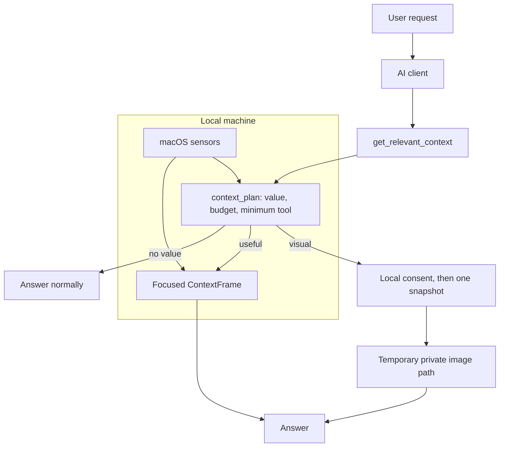

<div align="center">


# sense-mcp

### Privacy-first local situational awareness for AI agents.

MCP gave agents tools. Memory gives them history. Sense gives them the current moment.

[](https://github.com/ChrisJDiMarco/sense-mcp/actions/workflows/ci.yml)
[](./LICENSE)
[](https://nodejs.org/)
[](https://modelcontextprotocol.io/)
[](#requirements)
[](#privacy-contract)

</div>

`sense-mcp` is a local MCP server that lets an AI client ask for the smallest
useful slice of local context: what you are working on, whether you seem active,
whether time pressure is high, what devices are connected, whether optional
workspace state is relevant, and when explicitly requested, one camera,
app-window, or full-screen snapshot.

It is a context broker, not a surveillance layer. The agent does not receive a
constant feed. It asks Sense only when context would likely improve the answer,
and Sense answers with semantic, short-lived signals by default.

```text
You: "help me knock this out fast"

AI calls get_relevant_context:
  active in editor, coding, plugged in, next meeting soon, workspace dirty

AI:
  "You have a short window. Do the smallest useful step:
   run the failing test, fix only that path, and leave a handoff note."
```

## Why Sense Exists

Most AI assistants are oddly blind to the moment they are helping in. They can
read a repo, browse docs, and call APIs, but they do not know if you are in a
meeting crunch, actively coding, on battery, looking at an error screen, or
asking a visual question that needs a fresh snapshot.

Sense fills that gap with three rules:

| Rule | What it means |
|---|---|
| Ask first | Nothing is injected into every prompt. The client pulls context when it helps. |
| Say less | Emit semantic states like `coding`, `active`, `moderate` time pressure, and `quiet`. |
| Collect locally | Sensors run on the user's machine. The MCP client may forward returned results to its model provider. |

## What Sense Can Help With

| User asks | Sense gives the agent |
|---|---|
| "What am I doing right now?" | A compact situation card with activity, presence, device, workspace, and schedule signals. |
| "Can you help me debug this app?" | A recommendation to capture one app window without activating it, then inspect the returned image path. |
| "How do I look?" | A recommendation to take one explicit camera snapshot if camera snapshots are enabled. |
| "Do I have time for this?" | Time pressure, meeting proximity, active work mode, and confidence/unknowns. |
| "Pick up where we left off." | Current workspace name, branch, dirty count, and recent safe changes when workspace context is enabled. |
| "Should you use context here?" | A router decision with expected value, token budget, avoided tools, and privacy notes. |

## How It Works


```mermaid
flowchart TD
  U["User request"] --> C["AI client"]
  C --> R["get_relevant_context"]
  R --> P["context_plan: value, budget, minimum tool"]
  P -->|"no value"| N["Answer normally"]
  P -->|"useful"| F["Focused ContextFrame"]
  P -->|"visual"| V["Local consent, then one snapshot"]
  V --> I["Temporary private image path"]
  F --> A["Answer"]
  I --> A

  subgraph "Local machine"
    S["macOS sensors"]
    S --> F
    S --> P
  end
```

Sense exposes both raw MCP tools and a higher-level router:

1. `get_relevant_context` decides whether context helps.
2. If useful, it returns a context plan, a compact situation card, and the
   narrowest recommended follow-up tools.
3. If a visual answer is requested, the client can call exactly one explicit
   snapshot tool and inspect the returned `snapshot_path`.

Each MCP client gets a thin stdio adapter. All adapters for the current user
share one broker, scheduler, and in-memory state store through a private Unix
socket. Adapters reconnect and elect a replacement if the broker exits.

## Privacy Contract

Sense is built around one constraint:

> The AI should understand the moment without surveilling the person.

| Principle | Implementation |
|---|---|
| Local acquisition | Sensors run locally. Returned MCP results may go to the client's model provider. |
| Pull based | Context is requested by the AI client only when useful. |
| Ephemeral | Context frames describe now and expire quickly. |
| Semantic by default | The server emits classified states, not raw private content. |
| Exact media consent | Every camera, window, or full-screen capture needs local allow-once approval. |
| Temporary artifacts | Snapshot files use a private temp directory. They become eligible for opportunistic cleanup after two hours and may remain longer while Sense is idle. |
| Auditability | A bounded local ledger stores tool metadata, fixed summaries and hashes, and artifact paths without storing frames, pixels, or caller-provided reason and error text. Set `SENSE_LEDGER_DISABLED=1` to disable it. |

Read the full privacy model in [docs/PRIVACY.md](./docs/PRIVACY.md).

Sense does not defend against administrators, malware, compromised MCP clients,
or another process running as the same OS user. Local consent limits accidental
and remote tool misuse; it is not an operating-system sandbox.

## Current Status

The latest tagged release is [`v0.1.0`](https://github.com/ChrisJDiMarco/sense-mcp/releases/tag/v0.1.0).
`main` also contains the unreleased v1 hardening pass. Sense is not published to
npm yet, so install the current code from a GitHub source checkout.

Sense is client-agnostic MCP. The built-in sensors are macOS-first today, and
unavailable sensors degrade gracefully with diagnostics instead of hard failure.

Release checks:

| Check | Command or matrix |
|---|---:|
| Node build, tests, evals, and audits | `npm run check` |
| Node and package preflight | `npm run release:dry-run` |
| iOS companion | `npm run ios:build` |
| CI matrix | Node 22 and Node 24 |

See [CHANGELOG.md](./CHANGELOG.md), [ROADMAP.md](./ROADMAP.md), and
[docs/KNOWN_LIMITATIONS.md](./docs/KNOWN_LIMITATIONS.md).

## Quickstart

Today, the recommended install path is a GitHub source checkout:

```bash
git clone https://github.com/ChrisJDiMarco/sense-mcp.git
cd sense-mcp
npm ci
npm run build
```

Then connect one MCP client.

For Codex, write the config automatically:

```bash
node dist/index.js init --write --profile visual --workspace /absolute/path/to/workspace
```

For Claude Code or another CLI-style MCP client, use this server command in
that client's MCP config:

```bash
node /absolute/path/to/sense-mcp/dist/index.js
```

Restart your MCP client, then verify setup:

```bash
node dist/index.js doctor
```

Open local settings:

```bash
node dist/index.js settings --open
```

The settings panel lets users review central policy, toggle supported
capabilities, inspect broker and sensor health, and view the local privacy
ledger. Policy changes hot-reload in the shared broker.

Run the Node validation suite with:

```bash
npm run check
```

If Sense is later installed globally, replace `node dist/index.js` with
`sense-mcp` in the commands above.

## Setup Profiles

| Profile | Enables | Best for |
|---|---|---|
| `safe` | Semantic context only | Trying Sense with no explicit media. |
| `developer` | App-window snapshots | Coding, UI review, and debug help. |
| `visual` | Camera and app-window snapshots | Appearance, desk, room, and app questions. |
| `full` | Camera, app-window, and mic level | Broader semantic context with explicit media policy. |

Raw window titles are never enabled by a profile. Use `--raw-titles` only when
you intentionally accept best-effort redaction. Emails, HTTP(S) URLs, and long
digit sequences are stripped, but names, schemeless URLs, and other sensitive
title text may remain.

## Requirements

| Requirement | Why |
|---|---|
| Node.js 22+ | Runs the MCP server. |
| macOS | Current OS sensors use macOS APIs. |
| `ffmpeg` (optional) | Required for camera snapshots and mic-level sampling. |
| `icalBuddy` (optional) | Headless local Calendar timing when Calendar policy is enabled. |
| macOS permissions | Camera, Screen Recording, Microphone, Accessibility/Automation as needed. |

Install `ffmpeg` on macOS:

```bash
brew install ffmpeg
```

## Connect a Client

### Codex

The fastest path is:

```bash
node dist/index.js init --write --profile visual --workspace /absolute/path/to/workspace
```

Or add Sense to `~/.codex/config.toml` manually:

```toml
[mcp_servers.sense]
command = "node"
args = ["/absolute/path/to/sense-mcp/dist/index.js"]
startup_timeout_sec = 20
```

Environment migration fallbacks:

```toml
[mcp_servers.sense.env]
SENSE_CAMERA_SNAPSHOT = "1"
SENSE_SCREEN_SNAPSHOT = "1"
SENSE_WORKSPACE_ROOTS = "/absolute/path/to/workspace"
```

For ongoing changes, prefer central CLI policy:

```bash
node dist/index.js enable camera
node dist/index.js enable screen
node dist/index.js disable full-screen
```

The private policy file is authoritative per key. Environment variables apply
only when that key is absent from the policy file.

See [examples/codex_config.toml](./examples/codex_config.toml) and
[docs/clients/codex.md](./docs/clients/codex.md).

### Claude Code

Claude Code MCP configuration varies by installation, but the Sense server
process is the same:

```bash
node /absolute/path/to/sense-mcp/dist/index.js
```

For coding use, start with workspace and screen context:

```bash
SENSE_WORKSPACE_ROOTS=/absolute/path/to/workspace
```

Then enable app-window capture in central policy:

```bash
node dist/index.js enable screen
```

See [docs/clients/claude-code.md](./docs/clients/claude-code.md).

### Claude Desktop

Add Sense to `claude_desktop_config.json`:

```json
{
  "mcpServers": {
    "sense": {
      "command": "node",
      "args": ["/absolute/path/to/sense-mcp/dist/index.js"]
    }
  }
}
```

See [examples/claude_desktop_config.json](./examples/claude_desktop_config.json)
and [docs/clients/claude-desktop.md](./docs/clients/claude-desktop.md).

### Other Clients

Sense is a standard MCP server. It can be wired into any MCP client that can run
a local command and pass environment variables. Platform-specific sensor depth
is currently strongest on macOS.

## Settings Panel

Sense includes a localhost-only settings panel:

```bash
node dist/index.js settings --open
```

If Sense is later installed globally:

```bash
sense-mcp settings --open
```

The old `panel --open` command still works as an alias.

The panel opens through a private `0600` launcher file. Its bootstrap secret is
posted in the request body, never placed in a process argument, URL, browser
history, terminal output, or clipboard. The server consumes it once and issues
a distinct HttpOnly, SameSite session cookie; the base page, status endpoint,
and every settings API fail closed without that session. The iPhone companion
does not post plaintext check-ins to the settings server; use the separately
enabled encrypted LAN bridge.

The panel shows:

- capability state for Calendar, location, camera, window, full-screen, mic,
  raw titles, and workspace context
- trust model and health checks
- recent explicit snapshot metadata, never embedded pixels
- recent explicit tool activity
- local privacy ledger entries
- central policy source and migration fallbacks

Security properties:

- binds to `127.0.0.1`
- rejects non-local Host headers
- exchanges a one-use private launcher bootstrap for an HttpOnly session before
  serving HTML, status, or any API

## iOS Companion

The Swift iOS app in `apps/ios/SenseIOS` is a companion, not a replacement for
the desktop MCP server. Sense MCP still runs on the Mac where the AI client can
use local context. The iPhone app adds an intentional self-report channel:

- Action Button voice check-ins
- feeling, energy, stress, and focus sliders
- optional iPhone device state, motion/steps, ambient noise class, and Health summaries
- expiring semantic context payloads
- in-app GitHub, install command, MCP config, pairing, and connection test

The companion is a source-only developer preview, not an App Store or TestFlight
download. It requires iOS 18. To run it on a physical iPhone, open the Xcode
project, choose your Apple development team, replace the bundle identifier with
one your team can sign, select the device, and run:

```bash
open apps/ios/SenseIOS/SenseIOS.xcodeproj
```

Sending each check-in is explicit. Device state is included by default and can
be disabled. Motion, ambient-noise, and Health fields are off until enabled;
their OS permissions still apply. These are bounded structured fields rather
than raw streams, but some values are exact numbers, including battery level,
steps, distance, dBFS, active energy, heart rate, and sleep minutes.

Sense does not retain microphone recordings. Ambient-noise metering creates a
short-lived local audio file and deletes it after the sample. Voice check-ins
retain the transcript as the check-in note. Transcription uses Apple's Speech
framework and is not guaranteed to remain on-device.

The companion keeps up to 12 local check-ins in a 256 KiB-capped, atomic
Application Support file with complete file protection. It prunes expired
records on the next load or use. It removes legacy `UserDefaults` history only
after protected persistence succeeds, and starts unpaired with no localhost
fallback.

The Mac stores the latest accepted expiring payload in
`~/.sense-mcp/iphone-context.json` by default. It is permission-restricted
plaintext JSON, not encrypted at rest by Sense, and may include the check-in
note plus enabled device, motion, noise, or Health fields. Expired payloads are
removed when Sense next reads the file. Override the path with
`SENSE_IPHONE_CONTEXT_PATH`.
Physical iPhone sync is not exposed on LAN by default. Start the bridge-only
listener explicitly from the source checkout on a trusted network:

```bash
node dist/index.js settings --lan --open
```

Sense copies a secret-bearing pairing deep link to the clipboard and does not
print it. Clipboard managers and same-user processes are therefore inside the
pairing threat model; import the link promptly and clear it after use. The app
stores the secret in Keychain and accepts only private, link-local, loopback,
mDNS, or shared carrier-grade NAT (`100.64.0.0/10`) targets. Every request,
including loopback, requires that secret. Accepted request payloads and
successful response payloads use AES-256-GCM with method/path/timestamp/nonce
binding, per-process nonce replay rejection, a five-minute clock-skew window,
and body limits. Successful encrypted responses are bound to their request
nonce; rejected requests return generic plaintext errors. The listener uses
local HTTP, so network observers can still see addresses, paths, sizes, and
timing. There is no Bearer-token mode, and panel settings APIs are not exposed
on LAN.

## MCP Tools

| Tool | Purpose | Captures media? |
|---|---|---:|
| `get_relevant_context` | Classifies the request and returns a context plan with value, budget, recommended tools, avoided tools, and privacy notes. | No |
| `get_context_frame` | Bounded projected ContextFrame plus privacy, health, and assistive posture. | No |
| `get_screen_context` | Current activity and privacy-safe work context. | No |
| `get_user_state` | Presence, idle state, and input cadence. | No |
| `get_environment_context` | Time, power, devices, media, light/noise/location when available. | No |
| `get_schedule_context` | Meeting state and time pressure. | No |
| `get_domains` | Selected ContextFrame domains. | No |
| `take_camera_snapshot` | One camera frame after exact local allow-once consent. | Yes |
| `take_window_snapshot` | One app window without activating it, after exact local consent. | Yes |
| `take_full_screen_snapshot` | Main-display capture with explicit full-screen confirmation and local consent. | Yes |
| `take_screen_snapshot` | Deprecated window-only alias for `take_window_snapshot`; never full-screen. | Yes |

## MCP Resources

| URI | Purpose |
|---|---|
| `sense://context/current` | Compact cached semantic context. Reading it never forces a sensor refresh. |
| `sense://privacy` | Current privacy tier and per-capability status. |
| `sense://health` | Current broker or local-provider health and bounded diagnostics. |

Every ContextFrame includes a `privacy` block with per-capability status:
`granted`, `denied`, or `unavailable`. `capability_states` separately reports
`disabled`, `permission_denied`, `unavailable`, `no_signal`, `degraded`, `stale`,
or `healthy`. For denied or unavailable capabilities,
`privacy.capability_details` can include the sensor, state, reason, detail, and
fix hint.

Context tools accept `compact`, `brief`, `focused`, `debug`, and `diff`
projections plus `cached`, `if_stale`, or `force` refresh. The reported
`max_bytes` is enforced for the complete structured response at three bytes per
estimated token. `estimated_tokens` is conservative because model tokenizers
differ. `context_satisfied: true` means the client should not call another Sense
context getter for the same request. Every stored field expires on its own TTL;
refresh is limited to sensors declared for the requested domains.

## Sensor Matrix

| Sensor | Signal | Source |
|---|---|---|
| `active-window` | Frontmost app, activity class, privacy-safe window label | macOS `osascript` |
| `idle` | Seconds since last input, presence, input cadence | macOS `ioreg` |
| `time-context` | Day segment, daylight class, workday, local time | local clock |
| `battery` | Battery percent, power source, low-power flag | macOS `pmset` |
| `devices` | External display count, broad Bluetooth classes | macOS `system_profiler` |
| `workspace` | Configured workspace name, git branch, dirty count | local `git` |
| `calendar` | Meeting state, next-event minutes, pressure class | optional headless `icalBuddy` |
| `location` | Coarse location class from configured Wi-Fi names | macOS `networksetup` |
| `media` | Media app and playing/paused state | Spotify/Music via `osascript` |
| `ambient-light` | Lighting class when an ALS sensor exists | macOS `ioreg` |
| `audio-level` | Opt-in noise class and dB level, never audio content | `ffmpeg` AVFoundation |
| `focus-mode` | Env/Shortcuts bridge for Focus/DND mode | env or macOS Shortcuts |
| `camera` | Capture-enabled and consent-required status; acquisition happens only inside the explicit snapshot tool | policy plus `ffmpeg` AVFoundation when the tool runs |
| `health-bridge` | Optional local health/wearable semantic JSON | local JSON file |
| `weather-bridge` | Optional local weather/daylight semantic JSON | local JSON file |
| `iphone-context-bridge` | Optional expiring self-report context from the iOS companion | local JSON file |

Calendar is off by default. When enabled, Sense invokes optional headless
`icalBuddy`; it never scripts or launches Calendar.app. Prefer a direct calendar
connector for account-backed schedule data.

## Policy and migration variables

Use central policy for sensitive capabilities:

```bash
node dist/index.js enable calendar
node dist/index.js enable location
node dist/index.js enable camera
node dist/index.js enable screen
node dist/index.js enable full-screen
node dist/index.js enable mic
node dist/index.js enable raw-titles
node dist/index.js disable full-screen
```

All listed sensitive capabilities default off. Existing environment variables
remain migration fallbacks when the central policy file has no value for that
key.

| Env var | Effect |
|---|---|
| `SENSE_CAMERA_SNAPSHOT=1` | Enables explicit `take_camera_snapshot`. |
| `SENSE_SCREEN_SNAPSHOT=1` | Enables app-window capture. |
| `SENSE_FULL_SCREEN_SNAPSHOT=1` | Enables the separate full-screen policy gate. |
| `SENSE_CALENDAR=1` | Enables optional headless `icalBuddy` schedule probes. |
| `SENSE_LOCATION=1` | Enables coarse local location classification. |
| `SENSE_SNAPSHOT_DIR=/path` | Private temp directory for explicit snapshots. |
| `SENSE_MIC_LEVEL=1` | Enables one-second mic level sampling for `noise_class`. |
| `SENSE_MIC_DEVICE_INDEX=2` | Selects the AVFoundation audio device index. |
| `SENSE_WORKSPACE_ROOTS=/path/to/repo` | Enables git branch/dirty-count context. |
| `SENSE_RAW_TITLES=1` | Enables best-effort-redacted raw window titles. |
| `SENSE_HOME_WIFI_SSIDS=ssid1,ssid2` | Classifies home Wi-Fi without emitting SSIDs. |
| `SENSE_OFFICE_WIFI_SSIDS=ssid1,ssid2` | Classifies office Wi-Fi without emitting SSIDs. |
| `SENSE_FOCUS_MODE=deep_work` | Manual Focus/DND semantic override. |
| `SENSE_FOCUS_SHORTCUT="Sense Current Focus"` | Optional Shortcuts bridge for current Focus mode. |
| `SENSE_HEALTH_CONTEXT_PATH=/path/health.json` | Reads whitelisted wearable fields. |
| `SENSE_WEATHER_CONTEXT_PATH=/path/weather.json` | Reads whitelisted weather fields. |

## Explicit Snapshot Rules

Camera, app-window, and full-screen tools are separate from ordinary context
calls.

They follow six rules:

1. Disabled unless central policy enables the exact scope.
2. Require a current reason argument.
3. Show a local allow-once prompt immediately before capture.
4. Consume one signed receipt bound to kind, scope, target, normalized reason,
   and expiry.
5. Return MCP image content and a private temporary `snapshot_path`.
6. Never run for ordinary writing, coding, planning, or background context.

Window capture is the default screen action and does not activate the target
app. `take_full_screen_snapshot` is separate and requires
`confirm_full_screen: true`. `take_screen_snapshot` is a deprecated window-only
alias.

Snapshot files become eligible for bounded, opportunistic cleanup after two hours and may remain longer while Sense is idle.

## CLI

```bash
node dist/index.js init --help
node dist/index.js init --write --profile visual --workspace /absolute/path/to/workspace
node dist/index.js status
node dist/index.js doctor
node dist/index.js ledger
node dist/index.js consent list
node dist/index.js consent revoke <receipt-id>
node dist/index.js consent revoke all
node dist/index.js settings --open
node dist/index.js settings --lan --open
node dist/index.js enable camera
node dist/index.js enable screen
node dist/index.js enable full-screen
node dist/index.js enable calendar
node dist/index.js enable mic
node dist/index.js enable workspace /absolute/path/to/workspace
node dist/index.js disable mic
```

`enable workspace` writes `SENSE_WORKSPACE_ROOTS` into Codex configuration.
For Claude Desktop, Claude Code, and other clients, set that environment
variable in the client's MCP configuration instead.

`doctor` checks for Node 22+, checks `ffmpeg` for enabled camera or mic features,
checks `icalBuddy` and live Calendar diagnostics when Calendar context is
enabled, and discovers an authenticated settings panel on its actual port from
a private runtime receipt. Its client-config check only verifies that the Codex
config file is readable; it does not validate the Sense registration or inspect
other clients. It gives actionable setup checks:

```text
PASS Node.js: v22.0.0
PASS ffmpeg: available
PASS Central policy: loaded from /Users/me/.sense-mcp/policy.json
PASS Capture consent: local allow-once confirmation required; 0 active short-lived receipt(s)
PASS Shared broker: reachable through private per-user IPC
WARN Focus mode sensor: No focus-mode bridge is configured.
  Fix: Set SENSE_FOCUS_MODE=deep_work to provide a manual focus mode.
```

## ContextFrame Spec

Sense emits the open `context-frame/0.2` envelope. A frame includes privacy
capabilities, quality/staleness metadata, a compact situation summary, and
four semantic domains: screen, user, environment, and schedule. Device and
workspace readings are nested fields within those domains, not additional
protocol domains.

Small excerpt:

```json
{
  "spec": "context-frame/0.2",
  "privacy": {
    "tier": 1,
    "capabilities": {
      "screen_activity": "granted",
      "camera_snapshot": "denied"
    },
    "capability_states": {
      "screen_activity": "healthy",
      "camera_snapshot": "disabled"
    }
  },
  "situation": {
    "summary": "User appears active working in sense-mcp, activity looks like coding, with 3 changed items, plugged in.",
    "confidence": "medium",
    "evidence": ["workspace sense-mcp", "activity coding", "3 changed items", "power ac_power"],
    "unknowns": ["calendar: calendar_query_timeout"]
  },
  "assistive_posture": "do_not_interrupt",
  "quality": {
    "overall_freshness": "fresh"
  }
}
```

See [SPEC.md](./SPEC.md) for the full schema.

## Evals

[docs/evals/sense-mcp-eval-prompts.md](./docs/evals/sense-mcp-eval-prompts.md)
contains prompts for comparing Sense-enabled and baseline agent behavior.

The automated eval pack checks:

- relevance routing
- context value and token-budget policy
- camera and screen tool selection
- time-pressure fit
- workspace awareness
- privacy boundaries
- permission failure handling

Run the evals:

```bash
npm run build
npm run eval:routing
npm run eval:prompt-pack
```

The eval commands print the current fixture totals. Recorded historical results
live under `docs/evals/results/`.

See [docs/evals/results/2026-06-15-router-benchmark.md](./docs/evals/results/2026-06-15-router-benchmark.md).

## Writing a Sensor

A sensor is one small module implementing one interface:

```ts
import type { Sensor, Observation } from "../types.js";

export const mySensor: Sensor = {
  name: "battery",
  tier: 1,
  intervalMs: 30_000,
  domains: ["environment"],
  async sample(signal?: AbortSignal): Promise<Observation[]> {
    return [{
      sensor: "battery",
      domain: "environment",
      fields: { on_battery: true },
      observedAt: Date.now(),
      ttlMs: 60_000,
    }];
  },
};
```

Register it in `src/sensors/index.ts`.

Sensor rules:

1. Emit semantic states, never raw private content.
2. Do not make network calls from sensors.
3. Do not write raw sensor data to persistent storage.
4. Fail gracefully and return `[]` on errors.

See [CONTRIBUTING.md](./CONTRIBUTING.md).

## Docs

| Doc | Use it for |
|---|---|
| [docs/ARCHITECTURE.md](./docs/ARCHITECTURE.md) | Broker, scheduler, policy, and MCP boundaries |
| [docs/PRIVACY.md](./docs/PRIVACY.md) | Collection, consent, storage, and model-egress contract |
| [docs/KNOWN_LIMITATIONS.md](./docs/KNOWN_LIMITATIONS.md) | Platform, dependency, media, and client limits |
| [docs/clients/codex.md](./docs/clients/codex.md) | Codex setup and guidance |
| [docs/clients/claude-desktop.md](./docs/clients/claude-desktop.md) | Claude Desktop setup |
| [docs/clients/claude-code.md](./docs/clients/claude-code.md) | Claude Code setup notes |
| [docs/clients/cursor.md](./docs/clients/cursor.md) | Cursor setup notes |
| [docs/PROMPTING.md](./docs/PROMPTING.md) | Client prompting rules |
| [docs/EXAMPLES.md](./docs/EXAMPLES.md) | Example router outputs |
| [docs/evals/SENSE_BENCH.md](./docs/evals/SENSE_BENCH.md) | Automated and manual eval loop |
| [docs/RELEASE.md](./docs/RELEASE.md) | Release and npm checklist |

## Security

Please report vulnerabilities privately. See [SECURITY.md](./SECURITY.md).

## License

MIT
