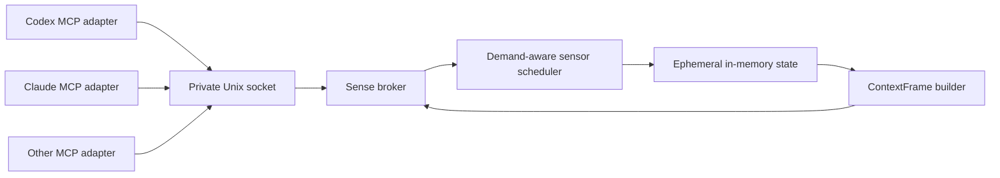

# Sense architecture

Sense separates the MCP connection from sensor acquisition. Every AI client
gets its own stdio adapter, but those adapters read from one per-user local
broker instead of starting another polling stack.

## Process model

The first adapter that cannot reach a broker elects one under a private lock
and starts it as a detached local process. Concurrent starters wait for the
same socket. Broker ownership is recorded with a PID, random owner token, and
socket device/inode identity. Sense only removes a stale socket after repeated
failed probes and ownership checks; a slow live broker is never unlinked.

Adapters reconnect and elect a replacement after broker loss. The broker exits
after the last client has been disconnected for the idle grace period, so
sensors do not continue polling indefinitely when no AI client is using Sense.

Default runtime paths are private to the current user. The socket directory is
mode `0700`; the socket, owner record, and election lock are mode `0600`.

## Sensor lifecycle

The broker owns the only scheduler and state store. Each sensor:

- rechecks availability instead of assuming startup state is permanent;
- runs at most one sample at a time;
- schedules its next run after the current run completes;
- applies bounded exponential backoff and jitter after failure;
- receives an `AbortSignal` so shutdown can terminate child processes;
- declares the domains it can refresh on demand.

State is held in memory. Readings are keyed by sensor and domain, and each
field retains its own expiry so one fresh partial update cannot prolong stale
fields.

## MCP boundary

The stdio adapter depends on an asynchronous `ContextProvider`, not a local
copy of broker state. Context tools use the current MCP SDK registration API,
publish input and output schemas, and return machine-readable
`structuredContent` plus one short text line.

Context projections are `compact`, `brief`, `focused`, `debug`, and `diff`.
Sense enforces a serialized byte ceiling for the complete structured response
and reports both the byte ceiling and a conservative token estimate. The
estimate is guidance because model tokenizers differ; the byte ceiling is the
enforced invariant. Context inputs accept 96 to 4,096 estimated tokens; router
inputs accept 160 to 4,096. The ceiling is three serialized bytes per estimated
token.

Context requests choose `cached`, `if_stale`, or `force`. The broker refreshes
only sensors declared for the requested domains and reports which domains it
refreshed. Each stored field keeps its own expiry.

## Privacy boundary

Sensor acquisition and broker state stay on the Mac. Context returned through
MCP is delivered to the configured AI client and may then be sent to that
client's model provider. Sense does not control the provider's retention or
training policy.

Sensitive acquisition is separately policy-gated. Camera and screen pixels are
never broker background sensors. Media capture also requires a short-lived
local consent receipt bound to media kind, scope, target, normalized reason,
and expiry. The receipt is consumed once immediately before capture. Window
capture is the normal screen action and does not activate the app;
full-screen capture is a distinct higher-risk tool for the main display.

The private per-user policy file is authoritative and hot-reloads by file
identity and modification time. Environment variables remain migration
fallbacks for keys missing from the file. Calendar, location, microphone,
camera, window, full-screen, and raw-title access default off. Calendar uses
optional headless `icalBuddy` and never launches Calendar.app.

The iPhone LAN bridge encrypts accepted request payloads and successful response
payloads with AES-256-GCM. Method, path, timestamp, and nonce are authenticated;
replay, skew, and body limits are enforced. Each successful response is bound
to its request nonce; rejected requests use generic plaintext errors. The pairing secret is
stored in iOS Keychain and is not printed. All targets, including loopback,
require the pairing secret and AEAD. The companion's local history is capped to
12 unexpired records in a 256 KiB atomic Application Support file with complete
file protection; legacy `UserDefaults` history is migrated and removed only
after protected persistence succeeds.

See [PRIVACY.md](./PRIVACY.md) for the data and consent contract.

## Runtime controls

| Variable | Purpose |
|---|---|
| `SENSE_BROKER_SOCKET` | Override the private broker socket path. |
| `SENSE_BROKER_IDLE_MS` | Override the broker idle-shutdown grace period. |
| `SENSE_POLICY_PATH` | Override the private central policy file. |

Ordinary installs should keep both defaults. Settings and sensor policy are
documented in the README and privacy guide.
